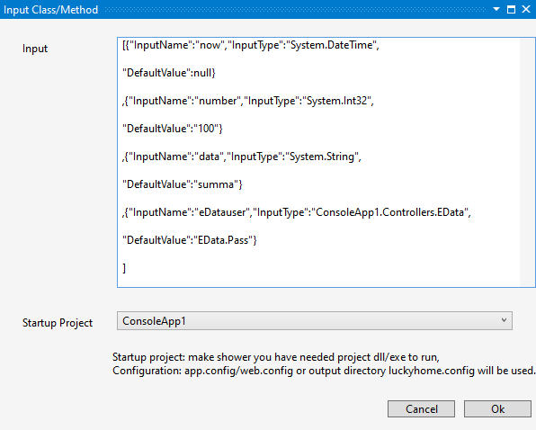
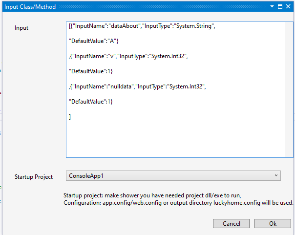
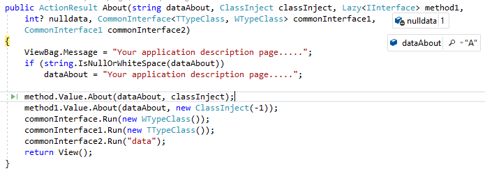

Welcome all,

We had designed this project to help develpers like me. 
who are spending most of there time in debuging there code.

Why should we code to test a method, 
why not use reflection. based on this idea only this project was build.

 
# DMH [Debug Method Helper](https://marketplace.visualstudio.com/items?itemName=BalajiPriya.DebugMethodHelper)

## Extension for Visual Studio 2015/2017/2019 & 2019 community edition 

Steps:
1. Download [DMH](https://marketplace.visualstudio.com/items?itemName=BalajiPriya.DebugMethodHelper) and install this extension for Visual studio 2015/2017/2019 & 2019 community edition
2. Restart Visual studio and open your c# project.
3. Right-click on any method and click "debug method"


4. Resolve dependency Interface using UI Map dependency/skip all dependency/map by code(for autofac etc),


5. Map your Interface by code as you do for your test project(autofac etc),


where in Run method input type will be of interface and output object you have to resolver and send back as class.

### (note : please don't change namespace(LouckHome), class and method name else auto mapping will not work)

```
//Add this code in your startup project selected in UI
using Autofac;//optional based on reliever you are using

namespace LuckyHome//do change else we cannot find
{
    public class LuckyHomeInterfaceClassMapper
    {
        private readonly static ILifetimeScope scope;

        static LuckyHomeInterfaceClassMapper()
        {
            HttpConfiguration config = new HttpConfiguration();
            scope = AutofacConfig.Register(config, false).BeginLifetimeScope();
	          //AutofacConfig.Register class is some thing you have to create and register your dependency
	    //In you case you can have different class name or different way of registering, you can do it that way.
	    
            //not only autofac you can use any resolver
            //If you want you can even do mock for some type
        }
		
        public object Run(Type type)
        {
            var output = scope.Resolve(type);
            //If you want you can even do mock for some type
            if (output == null)
            {
            }
            return output;

        }
    }
}
```
6. Set input parameter values for that method





7. Startup Project config will be used by default if you want you can also use a custom config
For custom config create new file name "luckyhome.config" in startup project output directory and add you configuration

8. Start debugging in few seconds



Not just for web services or web API it supports all frameworks written in c#.

### we also give support for dotnet Core version 2.1 & 3.1

To get Core Dependency supported please use below code.

### (note : please don't change namespace(LouckHome), class and method name else auto mapping will not work)

```
//Add this code in your startup project selected in UI
namespace LuckyHome
{
    public class LuckyHomeInterfaceClassMapper
    {
        // private readonly static ILifetimeScope scope;
        //static IConfiguration configuration;
        private static IServiceProvider serviceProvider;
        
         static LuckyHomeInterfaceClassMapper()
        {
            var services = new ServiceCollection();
            // Simple configuration object injection (no IOptions<T>)
            IConfiguration tempIConfiguration = new ConfigurationBuilder()
              .AddJsonFile("appsettings.json", optional: true, reloadOnChange: false)
              .AddUserSecrets("e3dfcccf-0cb3-423a-b302-e3e92e95c128")
              .AddEnvironmentVariables()
              .Build();
            
            services.AddScoped<IConfiguration>(_ => tempIConfiguration);
            //services.AddTransient<IframeInterface, FrameInterface>(); //based on you class and interface name input will change
            //services.Configure<PositionOptions>(tempIConfiguration.GetSection(
            //                                        PositionOptions.Position));//based on Configuration class name input will change
            services.AddLogging(builder => builder.AddConsole());
            
            serviceProvider = services.BuildServiceProvider();
        }

        public object Run(Type type)
        {
            object output = serviceProvider.GetService(type);
            if (output == null)
            {
                output = serviceProvider.GetRequiredService(type);
                if (output == null)
                    throw new NotImplementedException();
            }
            return output;
        }
    }
}
```
appsettings.json change the property to copy to output directory

Finally edit core project csproj file to run in windows 10 by adding this code.
```
 <PropertyGroup Condition="'$(Configuration)|$(Platform)'=='Debug|AnyCPU'">
    <RuntimeIdentifier>win10-x64</RuntimeIdentifier>
  </PropertyGroup>
  ```
Please share your valuable feedback, 
Thanks in advance.
